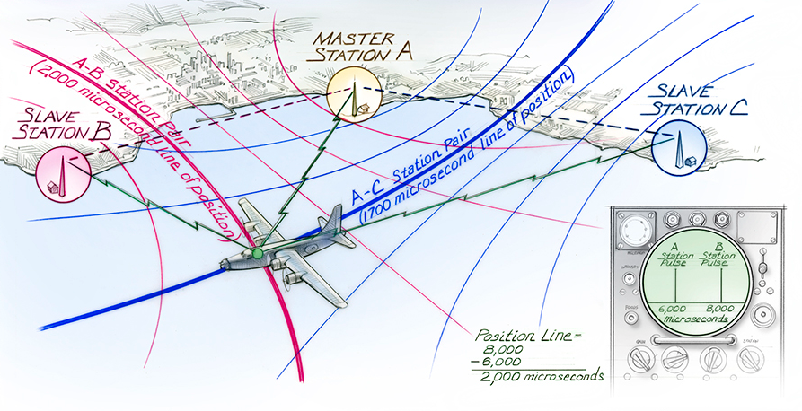
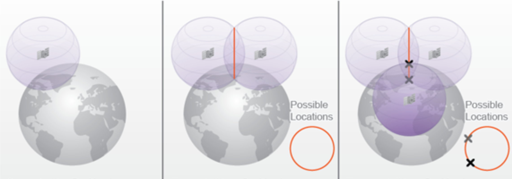
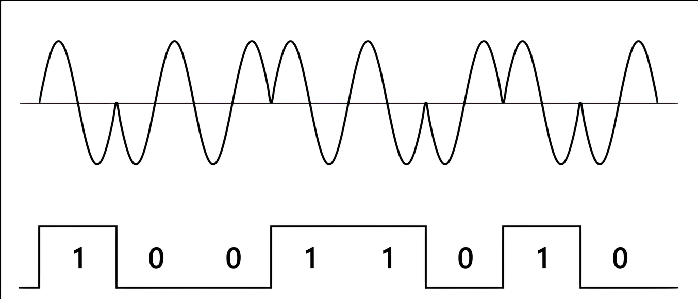
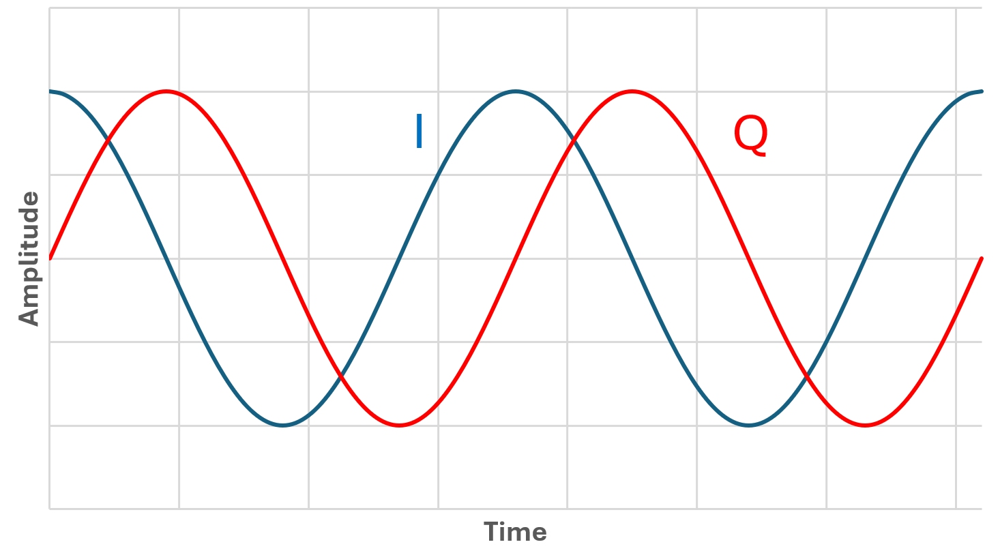

+++
title = "Decoding GPS signal with GO (part 1)"
date = '2026-04-27T13:48:32+02:00'
description = "From spatial geometry and I/Q signals to Gold Codes. Understanding the math and physics behind GPS to decode it from scratch using an RTL-SDR and Go"
tags = ["gps", "golang", "sdr", "rtl-sdr"]
+++

*Disclaimer: I'm not a spatial engineer and I'm learning as write this article, I have notions of linear Algebra that's it* 

## Introduction: The GPS Geometry Paradox
I was out for a run yesterday, and looking down at my Garmin watch, I wondered how can a device this small pinpoint my exact location, pace and elevation so precisely ?

I looked into how the Global Positioning System (GPS) works, and the underlying concept is pretty clever. In pure theory, you only need signals from three satellites to calculate a 2D position (latitude and longitude). One satellite gives you the current time, two give you a line of position and with three, by measuring the tiny differences in the arrival times of their radio signals, you can estimate your exact position on Earth.

## The legacy
Before satellites, ships relied on **Hyperbolic Navigation** systems like LORAN-C, heavily used during World War II. Ground stations would broadcast synchronized pulses. A plane or a ship's receiver would measure the exact time difference between receiving a pulse from Station A and Station B. This time difference plots a specific curve on a map called a **hyperbola**. By doing the same with Station B and Station C, you get a second hyperbola. Where the two curves intersect, that is your location.

[source: timeandnavigation.si.edu](https://timeandnavigation.si.edu/multimedia-asset/hyperbolic-system)

### Why a hyperbola and not circles that we can draw on a map with a compass?

It's because in an ideal world where all clocks are perfectly synchronized, your receiver would know the exact moment the signal left the tower. You could measure the exact travel time, calculate the absolute distance and draw a perfect circle around the tower.

But in the real world, ships did not carry million-dollar atomic clocks. They could not measure absolute time, only **relative time**. A receiver would simply start a stopwatch when it heard Station A and stop it when it heard Station B. It only knew the exact time difference between the two signals. And in geometry, if you plot all the points on a map where the difference in distance from two fixed spots is constant, you do not get a circle. You get a hyperbola.

## The GPS Revolution: From Hyperbolas to Spheres

To move from these complex hyperbolas to simple, precise circles, we needed a way to measure the exact distance to each beacon. This shift from "time difference" to "absolute distance" is the foundation of what we call **trilateration**.

Is it like triangulation ? No, and you have probably heard someone in a movie say, "Keep talking, we are triangulating the suspect's phone!" while it sounds cool, it is technically wrong for GPS. 

As the name implies tri*angulation* uses angles so if you have two cell towers that you know the exact compass angle your signal is coming from, you can draw two invisible lines and you are where the lines cross.

Trilateration uses distances GPS receivers have no idea which direction the signal is coming from (they do not measure angles). Instead, by calculating the time the signal took to arrive, they calculate a strict distance (in a perfect vacuum). 

The satellite draws a giant imaginary sphere around itself with that distance as the radius. With three intersecting spheres, you narrow it down to two possible points (one in space, one on Earth). With four spheres, you get your exact 3D location.

[source: e-education.psu.edu](https://www.e-education.psu.edu/geog160/node/1923)

## Visualizing Trilateration: The 3D Printer Analogy

So, much like the stepper motors of a **delta 3D printer**, we use known fixed points to calculate a central position. But instead of physical arms moving in centimeters, the "arms" are radio waves measured in nanoseconds. 

If we apply the same principles to GPS, instead of X and Y in centimeters, we use latitude, longitude and nanoseconds. And sorry, i'm not really good at making images with Photoshop ah ah.

### The Need for Extreme Precision
With nanoseconds, you have to make sure satellites are all in sync with each other and have an internal clock that is freaking precise. That’s why they use **atomic clocks** and not quartz-based oscillators quartz can drift

Imagine a drift of just one millisecond: instead of locating you in Spain, you are now in the middle of France, because an error of only **10 nanoseconds** leads to a positioning error of **3 meters** as described in [this post about GPS and Relativity](https://www.gpsworld.com/inside-the-box-gps-and-relativity)

### The Moving Reality & The Atmosphere
As its name suggests, it is a positioning system directly inspired by those hyperbolic ancestors. But instead of relying on ground stations, it takes the beacons into space. But there is a small issue, because our space beacons are perpetually moving, but fortunately, they constantly broadcast an update of their trajectory (called **ephemeris**), so we always know their exact coordinates in space.

Also, they are not moving on a random orbital plane, there are six orbital planes and each satellite orbits the earth in 12 hours. Why six orbital planes ? Because we need four satellites to have a precise location, three are only needed to have a position and a fourth one is used to calculate elevation, useful because there is a subtile difference between sitting on the ocean, deep in the Mariana trench or on the top of Everest mount ! The last satellite is also here to resolve the unknown of the equation, the offset of our local clock $\Delta t$

In order to provide full coverage of the Earth we need to have 24 satellites and you can follow [them all here](https://www.nstb.tc.faa.gov/RT_WaasSatelliteStatus.htm) or [a specific one here](https://www.n2yo.com/satellites/?c=20) 

To receive a radio wave, we must know its frequency and we have to understand why all GPS satellites share a common frequency (CDMA) instead of having a different frequency for each one (FDMA), and why our atmosphere plays a huge role in this.

However, we must also account for the atmosphere. While radio waves travel at the speed of light in a vacuum, they can slow down when hitting the **Ionosphere** and there two systems used to account for this.

### FDMA
Frequency Division Multiple Access is a method in which each satellite has its own frequency. On paper, it sounds great: on a specific channel, you get a specific satellite. GLONASS (Globalnaya Navigatsionnaya Sputnikovaya Sistema), the Russian version of GPS, actually used this in its early stages. 

The issue is that Earth has many atmospheric layers. We know radio waves can be blocked by a concrete wall or a sheet of aluminum, but space is mostly empty, right ? Yea, in a vacuum, radio waves travel at the speed of light without issue. But when they hit the Ionosphere (a layer full of charged ions), it acts like a giant prism. The signal is dispersed and actually slowed down. This is a big deal for a timing-based positioning system. 

If Sat A is beaconing at 1500 MHz and Sat B at 1600 MHz, the lower frequency will have a harder time passing through the Ionosphere and will be slowed down more than the higher one.

Note : The Troposphere (where our weather happens) can also be challenging, but it is not dispersive as the Ionosphere, it slows down all frequencies in this range equally.

### CDMA
Code Division Multiple Access is another method in which all satellites use the same frequency and this can be quite difficult to differentiate one satellite from the other, but in reality they scream a specific code named **PRN** code (Pseudo Random Noise) of **1023** bits. By using pattern matching, we can pick out a specific satellite from the noise. 

And the huge benefit ? Since all satellites are using the same frequency, the atmospheric "prism" effect slows down all signals equally. Thus keeping our distance calculations consistent and slightly more accurate.

Note : The frequencies are normalized and categorized in bands ranging from L1, L2 and L5 (L3 and L4 are reserved)

| Band | Frequency in MHz                 | Usage                                                            |
| ---- | -------------------------------- | ---------------------------------------------------------------- |
| L1   | 1575.42     (**10.23** × 154)    | Primary civilian signal (C/A Code) and P(Y) code                 |
| L2   | 1227.60     (**10.23** × 120)    | Military use and ionospheric correction for high-end receivers   |
| L3   | 1381.05     (**10.23** × 135)    | Nuclear Detonation (NUDET) Detection System                      |
| L4   | 1379.91..   (**10.23** × 1214/9) | Atmospheric research and ionospheric study                       |
| L5   | 1176.45     (**10.23** × 115)    | "Safety of Life" (SoL) or high-precision civilian use (Aviation) |

Note : The **10.23 MHz** the internal clock of our satellite that is why the data sent contains 1023 bits of Pseudo Random Noise code (PRN) (sent at 1.023 Mbps)

And in the rest of the article I think i'll stay on the L1 band as it's the most basic one.

### Slightly ? Ah yes, you didn't know about the Doppler effect ? 

Indeed, our satellite is moving extremely fast, radio is a wave, like light or sound, for instance, when you hear a fire truck coming, the siren's pitch increases as it approaches you and drops as it passes by. Distant stars exhibit "redshift" as they move away from us in an expanding universe.

For our satellite signal, it's the same, we must account that the signal will have its frequency shifted as it's moving toward or away from us

To receive GPS data, we can't just listen on 1575.42 MHz, we have to search for the signal within a "Doppler window" to account for this frequency shift.

## Decoding the Wave : I/Q Signals ?

When my Garmin watch listens to the 1575.42 MHz GPS signal, it is not just measuring how "loud" the radio wave is like a simple radio using Frequency Modulation (FM) or Amplitude Modulation (AM) to translate the analog signal into a sound wave. 

The satellites do not send data by changing the volume. Instead, they hide their binary data (the 0 and 1) inside the actual rhythm of the wave. This technique is called **Binary Phase Shift Keying (BPSK)**.  Imagine a wave going smoothly up and down, and suddenly it reverses direction mid-cycle. That reversal is a bit flipping from a 0 to a 1. 

If my watch only measured the raw volume (the amplitude like AM radios), it would completely miss this flip. It would just hear a constant, meaningless *Krhhhhssssssssss*. To catch these invisible flips, we need to split the listening process into two parallel channels: **In-Phase (I)** and **Quadrature (Q)**.

Think of it like trying to catch a ball with one eye closed. You lose your depth perception because now you are seeing the world in 2D. If the ball moves straight at you, it is very hard to tell its exact speed or if it suddenly changes direction.

Using **I** and **Q** channels is basically giving my watch two eyes to see the radio wave in full 3D.

With only one channel, the radio wave is flat. If the wave flips exactly at the moment it crosses the zero line (when it has no volume), my watch would have a blind spot and completely miss the data.

By adding the **Q** channel offset by exactly 90 degrees, one of the two eyes will always be at a peak when the other is at zero. my watch never has a blind spot. 

It tracks the signal as a continuous spiral, instantly spots the exact microsecond the data flips and allows to read the Doppler shift to know if the satellite is moving towards you or away from you.

## Finding the Needle in the Haystack

Even with our stereo vision **I/Q** and the Doppler windows open, there is an issue. Our satellite has almost less than the power of a light bulb, around 50 Watts. It's not a lot, now imagine this light bulb 20 000 Km away, you get it ?... Yea it's peanuts. Now this signal must traverse vacuum, ionosphere and clouds and from what I've read it's around -160 dBW ($10^{-16}$ Watts)... Nothing.

That is **quieter than the background static of the universe**. It’s like trying to hear a whisper in the middle of an [Erra concert](https://www.youtube.com/watch?v=lG1ZvbTmamU).

We can hear the whisper but it's quiet. On a modern receiver there is a **LNA** (Low Noise Amplifier) which is an active amplifier to hear the signal without adding too much noise or *Hisssssssssss*.

But even then, the signal is still messy and unreadable because all 24 satellites in the constellation broadcast on the exact same 1575.42 MHz frequency.

To solve this "crowded room" problem, the satellite uses a **Carrier Wave** (the 1575.42 MHz truck) that doesn't just carry data, but mixes it with a very specific type of noise called **PRN**.

And to read the **I/Q** channels, we must strip this **PRN**. This is where **Gold Codes** come in (named after their creator, Robert Gold). Every satellite has its own unique Gold Code key. Now we just need to generate our **PRN** slide it across the signal and when our reference code aligns perfectly with the satellite's code, it creates a **mathematical resonance**. Booom !

The random noise collapses, and the hidden signal (our **I/Q**) spikes up through the static like a needle jumping out of a haystack using a mega huge electro magnet. This process provides enough processing gain to pull the signal from under the noise floor.

Once this match is found, the phase flips become visible and the binary data is ready to be extracted.

## From wave to data

Once we successfully track I and Q channels and read the phase flips, we finally get a stream of binary data. A stream at 50 bit ... per ... second... That pretty slooow. But it's not an issue because the data is optimized for this speed using **frames**.

A frame contains 1500 bits and takes around 30 seconds to download... In order to not listen for that long and risk corruption, this frame is subdivided in five subframes and theses contain 300 bits and take 6 seconds to arrive. Each subframe contains specific data :

| Subframe | Category                    | Data                                                                                       | Usage                           | Description                                                                                                     |
| -------- | --------------------------- | ------------------------------------------------------------------------------------------ | ------------------------------- | --------------------------------------------------------------------------------------------------------------- |
| 1        | Clock & Health              | GPS Week Number The satellite's health status The clock correction parameters        | Synchronize time                | It tells my watch that the satellite is healthy and provides the exact time while fixing any atomic clock drift |
| 2        | Ephemeris (Part 1)          | Keplerian parameters (like eccentricity) that describe the geometry of the orbit           | Define the orbit's shape        | This is the first half of the holy grail for our trilateration math                                             |
| 3        | Ephemeris (Part 2)          | Remaining orbital parameters (like inclination) that describe the orientation of the orbit | Calculate the exact 3D position | Combined with subframe 2, it gives our the precise X, Y, Z coordinates of the satellite                         |
| 4        | Atmospheric Models & Extras | Ionospheric correction math UTC offset Rough data for satellites 25+                 | Fix atmospheric delays          | It provides the math needed to correct the ionospheric "prism" effect so our distances stay accurate            |
| 5        | Almanac (Main)              | A low-resolution map of the entire constellation (satellites 1 to 24)                      | Speed up the next connection    | It tells your receiver which other satellites are currently overhead so it can lock onto them faster next time  |

Now the last part we need in order to decode a subframe is "something" that tells us the beginning of it. Fortunately, a subframe starts with the exact same, hardcoded 8-bit signature: `10001011` and it's called the **Preamble**. 

So my watch is scanning the incoming noise, locking on the actual satellite using a Gold code, waiting for the `10001011`, then reads the next bits to check the parity, with a mathematical operation in order to verify that the data was not corrupted by space noise and if all is good, we can start to extract data !

Note : So what's a GPS signal sounds and looks like ? 



[source: sigidwiki.com](https://www.sigidwiki.com/wiki/Radio_Navigation_Satellite_System_(RNSS))

## Catching Radio Waves from Space

So what's my goal here? Honestly, I have free will, an RTL-SDR and a dangerous amount of time for tinkering.

An RTL-SDR is a Software Defined Radio receiver. It’s a cheap USB dongle that acts as a wideband radio for your computer. 

It can listen to almost anything from 500 kHz to 1.766 GHz and since GPS signals live around 1575.42 MHz (L1), they are well within the operating range of my SDR. 

In theory, I could locate myself from scratch using nothing but this usb stick and some code.

### The Plan: 
- Learn the GPS math (done!)
- Mock a GPS signal (because I’m lazy and debugging in the cold outside is overrated).
- Write the software to pinpoint my location. Easy, right?
 
Why Go? I could use Python or a specialized math language, but as I dug deeper, I realized the humongous scale of the task. 

To get a precise position, I need to track at least four satellites simultaneously. 

But remember the Doppler effect ? For a satellite broadcasting at 1575.42 MHz, the frequency shifts between $+10$ kHz and $-10$ kHz. 

To catch the signal, my code has to bruteforce the search and for each satellite, I need to test: 1023 possible Gold Code positions using around 1 (0 Hz) + 40 frequency bins (shifting by 500 Hz increments across the 20 kHz Doppler window because we don't need to go lower than 500 Hz).

$$1023 \times 41 = 41,943 \text{ combinations per satellite}$$

To track four satellites, that’s 167,772 combinations every single second. 

This is where Go should be my best friend using the concurrency model to keep this processing real-time without melting my CPU.

In the next articles i'll start to setup my workbench and try to decode GPS signal, then making sense of the data and finding where I am using Go.
