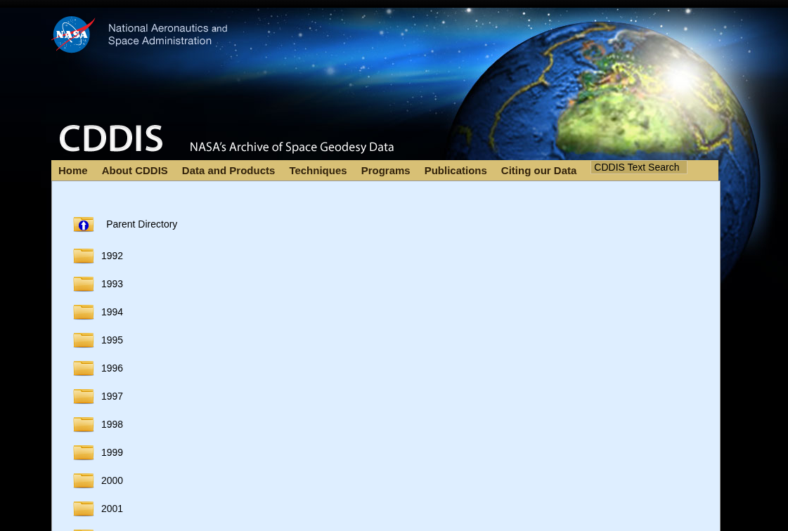
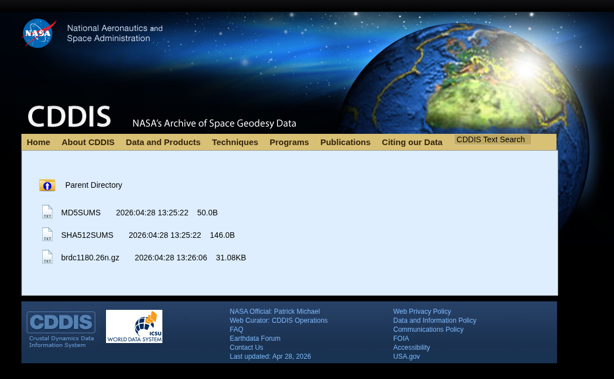
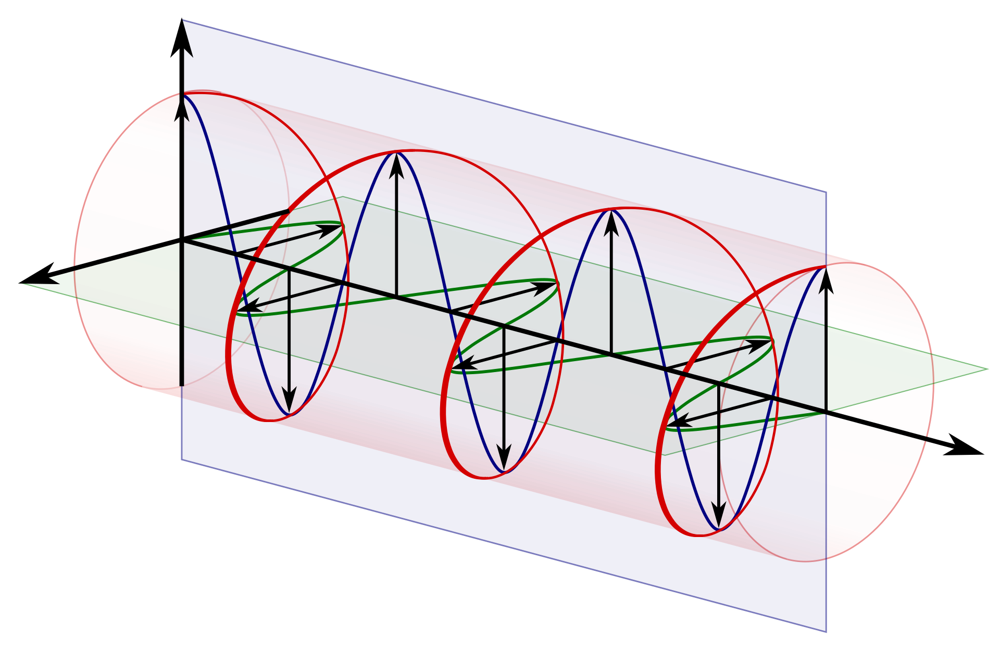
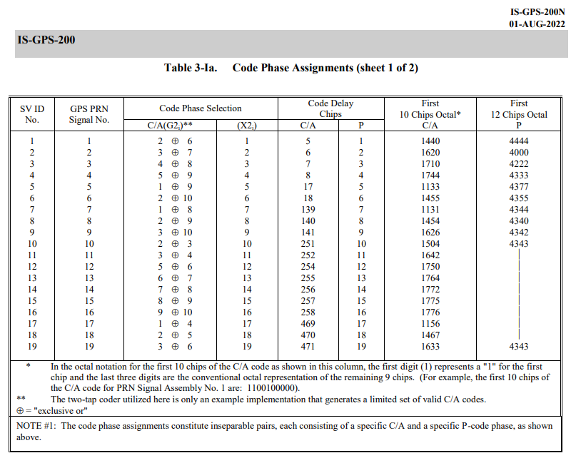
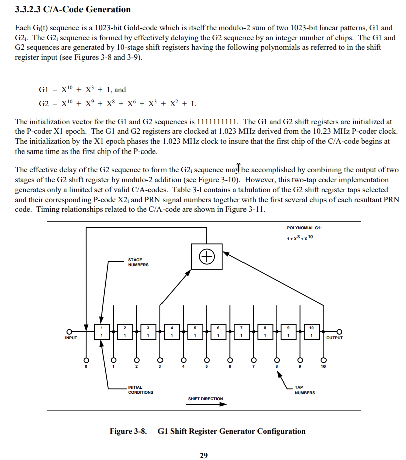
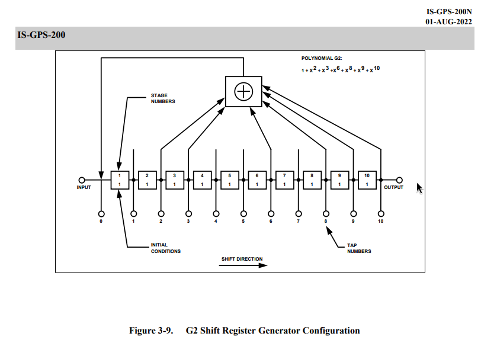
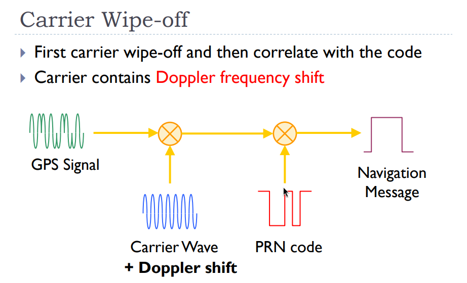

+++
date = '2026-05-09T16:12:12+08:00'
title = "Decoding GPS signal with GO (part 2)"
description = "Part 2 of the journey. Moving from raw I/Q samples to actual satellite detection. It’s brute-force, it’s tremendously slow, but we finally have a lock on satellites using pure Go"
tags = ["gps", "golang", "sdr", "rtl-sdr"]
+++

I've started by analyzing what I'll use and not use, for my personal enrichment I don't want to use a GPS or a library that will do it all for me and play Lego bricks. 

First of all, we need a structure for our project and a pretty Makefile to help us automate some things

```shell
gps-decoder/
├── bin/
│   └── .gitignore
├── cmd/
│   └── gps-decoder/
│       └── main.go
├── data/
│   └── .gitignore
├── internal/         
│   ├── dsp/
│   └── gps/
├── .gitignore
├── go.mod
├── LICENSE
├── Makefile
└── README.md
```

I'll split the DSP (Digital Signal Processing) and GPS processing in separate folders as the I/Q Signal can be used without GPS and vice versa.

First of all, we need a signal to work with. As mentioned in my last article, I am a bit lazy and going outside to record a signal that I'm not sure is usable is counterintuitive, so we could download a signal from the web, but still I'm not sure if it will be "pure" enough so I can deal later with noise or artefacts. 

After searching a bit, I've found a cool software used for generating GPS signal on a given location named [gps-sdr-sim](https://github.com/osqzss/gps-sdr-sim) and using a command, we can create our mock signal that I'll store in the data folder of our project 

Now we can build the gps-sdr-sim 

```shell
cd ~/Dev/Projects
git clone https://github.com/osqzss/gps-sdr-sim.git
cd gps-sdr-sim
gcc gpssim.c -lm -O3 -o gps-sdr-sim
mkdir -p ../gps-decoder/tools
cp gps-sdr-sim ../gps-decoder/tools
cd ../gps-decoder/data
```

In order to generate a data file, we must retrieve a navigation file for trajectories of the satellites at a given moment, as this tool cannot "guess" the trajectories or the orbits of our satellites, we must provide it. It can be found on the [NASA website](https://cddis.nasa.gov/archive/gnss/data/daily/) behind a login page (free)



I'll take the latest file created `brdc1180.26n.gz` and check it with the signature file `SHA512SUMS`



```shell
$ sha512sum -c SHA512SUMS --ignore-missing
brdc1180.26n.gz: OK
$ gunzip brdc1180.26n.gz
```

## RINEX : No, it's not a nasal spray

Now that we have unzipped our file, we have a file with a bunch of numbers. It's a **RINEX Version 2** Navigation file. Used log satellite orbits, It contains every parameter needed to draw the 3D trajectory of every GPS satellite in the constellation

```
2              NAVIGATION DATA                         RINEX VERSION / TYPE
CCRINEXN V1.6.0 UX  CDDIS               28-APR-26 13:53     PGM / RUN BY / DATE 
IGS BROADCAST EPHEMERIS FILE                                COMMENT             
    0.2235D-07  0.1490D-07 -0.1192D-06 -0.5960D-07          ION ALPHA           
    0.1249D+06  0.6554D+05 -0.1966D+06  0.6554D+05          ION BETA            
    0.931322574616D-09 0.000000000000D+00   405504     2416 DELTA-UTC: A0,A1,T,W
    18                                                      LEAP SECONDS        
                                                            END OF HEADER       
 1 26  4 28  0  0  0.0 0.287999864668D-03-0.875388650456D-11 0.000000000000D+00
    0.830000000000D+02-0.640625000000D+02 0.452340270359D-08-0.894860405956D-02
   -0.327453017235D-05 0.172578555066D-02 0.864453613758D-05 0.515361820793D+04
    0.172800000000D+06 0.279396772385D-07 0.213447299202D+01 0.745058059692D-08
    0.957481382371D+00 0.213500000000D+03 0.181159921992D+00-0.812676708390D-08
   -0.204651381694D-09 0.100000000000D+01 0.241600000000D+04 0.000000000000D+00
    0.200000000000D+01 0.000000000000D+00-0.931322600000D-08 0.595000000000D+03
    0.169170000000D+06 0.400000000000D+01 0.000000000000D+00 0.000000000000D+00
 2 26  4 28  0  0  0.0 0.875713303685D-04 0.773070496507D-11 0.000000000000D+00
    0.430000000000D+02-0.719375000000D+02 0.448625829924D-08 0.150356670054D+01
   -0.379234552383D-05 0.168070202926D-01 0.726059079170D-05 0.515376184463D+04
    0.172800000000D+06 0.350177288055D-06 0.197213348771D+01 0.894069671631D-07
    0.962531214660D+00 0.240593750000D+03-0.775585815931D+00-0.799033282943D-08
   -0.345728686702D-09 0.100000000000D+01 0.241600000000D+04 0.000000000000D+00
    0.200000000000D+01 0.000000000000D+00-0.176951289177D-07 0.430000000000D+02
    0.171228000000D+06 0.400000000000D+01 0.000000000000D+00 0.000000000000D+00
 4 26  4 28  0  0  0.0 0.549969263375D-04 0.147792889038D-11 0.000000000000D+00
    0.114000000000D+03-0.431250000000D+01 0.478912805784D-08 0.892047618255D+00
   -0.113621354103D-06 0.371843064204D-02 0.411458313465D-05 0.515370613861D+04
    0.172800000000D+06 0.540167093277D-07-0.209072729418D+01-0.558793544769D-07
    0.970967165411D+00 0.301875000000D+03-0.287274987212D+01-0.837320592049D-08
   -0.682171272314D-10 0.100000000000D+01 0.241600000000D+04 0.000000000000D+00
```

The first few lines set the rules for the whole day before diving into specific satellites like *PRN01*. 

We can see **ION ALPHA** and **ION BETA**, remember ? I've talked about the "prism" effect due to the Ionosphere. Those are parameters used to calculate the delay of the GPS signal passing through Ionosphere the using the [Klobuchar model](https://gssc.esa.int/navipedia/index.php/Klobuchar_Ionospheric_Model). 

**DELTA-UTC** and **LEAP SECONDS (18)** are here because GPS time does not account for leap seconds, but standard Earth time (UTC) does, because Earth's rotation is slowing down. To keep our clocks aligned with the sun, scientists occasionally add a "leap second" to UTC. 

And each line corresponds to a specific satellite at a specific moment `1 26 4 28 0 0 0.0 0.287999864668D-03-0.875388650456D-11 0.000000000000D+00` : 

- `1` is the satellite PRN 01
- `26 4 28 0 0 0.0` is the timestamp for April 28, 2026, at 00:00:00
-  `0.287999864668D-03-0.875388650456D-11 0.000000000000D+00` is ... some error correction ah ah 
	- `0.287999864668D-03` **(Clock Bias):** The current time offset. Even atomic clocks aren't perfectly accurate, so the satellite constantly broadcasts its exact error
	- `-0.875388650456D-11` **(Clock Drift):** The speed at which the clock's error worsens with every passing second
	- `0.000000000000D+00` **(Drift Rate):** The acceleration of that error over time. Because atomic clocks are incredibly stable, this value is practically always exactly zero

The error correction codes are important because an error of 0,000287 seconds gives me an offset of 86 Km on earth, not ideal ah, ah.

And all the following numbers under are the actual Keplerian parameters for our satellite. They describe the eccentricity of its orbit, its inclination relative to the equator. And you can learn more about this file type in [this small document](https://files.igs.org/pub/data/format/rinex211.txt)

For us this parenthesis is closed, and now we can generate our "GPS radio wave file" using `gps-sdr-sim`

## Creating virtual satellites 

First in order to use `gps-sdr-sim` we have to use some parameters, like : 
- `-e brdc1180.26n` ou RINEX file
- `-l 44.845701, -0.572246` a location so the soft can create the moving of the satellites and the Doppler effet and all of that
- `-s 2000000` is the sampling frequency, I try to mimic the `RTL2832U` of my RTL-SDR that can output data up to 2.4 MSPS, so setting it to 2.0 MSPS give me safe range to work with and also because remember the PRN code is transmitted at **1.023 MHz** and I've read that according to the **Shannon-Nyquist** theorem, in order to digitalise a signal, we must sample it at the double of it's frequency, in our case 2.046 MHz.
- `-b 8 ` to set the bit depth, by default it's at 16 bits, and is perfect, but with an SDR we won't have this much quality IMO

So this is our command : 

```
$ ../tools/gps-sdr-sim -e brdc1180.26n -l 44.845701, -0.572246 -s 2000000 -b 8

Using static location mode.
xyz =   4529473.6,    -45240.0,   4475207.1
llh =   44.845701,   -0.572246,         0.0
Start time = 2026/04/28,00:00:00 (2416:172800)
Duration = 300.0 [sec]
05  197.5  40.9  21933661.3   2.2
14   70.3  48.5  21603577.1   1.9
15  304.4  63.0  20295757.7   1.6
18  283.6  10.0  24602408.6   4.3
20   16.5  84.2  20260349.8   1.5
21  174.4  22.5  23466521.8   3.1
22   93.3  55.4  21152645.7   1.8
23  319.6  19.6  23820881.8   3.3
24  259.9  30.5  22354774.0   2.6
30   64.8  26.4  23180705.7   2.9
Time into run = 300.0
Done!
Process time = 17.1 [sec]

$ ls -lah                   
Permissions Size User  Date Modified Name
.rw-r--r--@   14 dayio 10 Apr 16:54  .gitignore
.rw-r--r--@ 140k dayio 28 Apr 16:00  brdc1180.26n
.rw-r--r--@ 1.2G dayio 28 Apr 17:52  gpssim.bin
.rw-r--r--@  146 dayio 28 Apr 15:58  SHA512SUMS
```

Now we have a pretty tiny file `data/gpssim.bin` that weight 1.2 Gb ah ah.

### Reading the radio waves 

So, in terms of code, what do we need to do to read the raw I/Q waves? First, we need to read the binary file and fill a buffer.

Since our SDR samples at 2.0 MSPS (2,000,000 samples per second), exactly 2,000 samples are generated every single millisecond. Because each sample contains two values (In-Phase and Quadrature), we need to store $2000 \times 2 = 4000$ distinct values to read exactly one millisecond of the signal.

In Go, our buffer initialization looks like this: `make([]int8, 4000)`. We use 8-bit signed integers (`int8`) because our simulated signal (and our actual SDR hardware) outputs data in values ranging strictly from -128 to +127. Each value takes exactly one byte of memory.

As we ingest those 4,000 bytes, the structure is perfectly interleaved. The first byte is the In-Phase (I) value, the second is the Quadrature (Q) value, and it repeats sequentially: I, Q, I, Q, I, Q...
#### Why does the wave spin? (RHCP)

These values represent our radio wave turning in a clockwise spiral. This is called **RHCP** (Right-Hand Circular Polarization, and no, it does not stand for the Red Hot Chili Peppers).

Remember the "stereo vision" analogy from the previous article? If the satellite used a standard linear antenna, we could only receive the signal if our receiving antenna was perfectly aligned with it. Instead, the satellite uses a cross-shaped antenna design. By sending the **I** signal on one wire and the **Q** signal (delayed by exactly 90 degrees) on the other, the two vectors physically merge in space to create a continuous, spinning spiral wave.

Also, a good reason to use **RHCP** signal is when you are in a city. When a wave bounces off a building, it instantly inverts into an **LHCP** wave. Our **RHCP** antenna acts like polarized 3D glasses, it is physically blind to LHCP echoes and rejects them naturally. If a signal bounces twice and reverts to RHCP, its strength is so depleted it gets swallowed by the background noise, so we only get the fresh signal straight from space. And if you are an FPV drone pilot, that's exactly why there are both LHCP and RHCP antennas, and why your transmitter and receiver must match !



```go
package main

import (
	"encoding/binary"
	"fmt"
	"log"
	"os"
)

func main() {
	file, err := os.Open("./data/gpssim.bin")
	
	if err != nil {
		log.Fatalf("Error : %v", err)

	}
	defer file.Close()

	buffer := make([]int8, 4000)

	err = binary.Read(file, binary.LittleEndian, &buffer)
	if err != nil {
		log.Fatalf("Error : %v", err)
	}

	for i := 0; i < 10; i += 2 {
		signalI := buffer[i]
		signalQ := buffer[i+1]
		fmt.Printf("sample %d -> I: %4d, Q: %4d\n", (i/2)+1, signalI, signalQ)
	}
}
```

```shell
$ make run
go build -o bin/gps-decoder cmd/gps-decoder/main.go
./bin/gps-decoder
sample 1 -> I:  -54, Q:   -1
sample 2 -> I:  -45, Q:   -1
sample 3 -> I:  -14, Q:   -1
sample 4 -> I:   -4, Q:    0
sample 5 -> I:   28, Q:    0
```

Yes, we have our data! As explained previously, this signal contains the raw data for all the satellites of the constellation currently above us, broadcasting on 1575.42 MHz.

### DSP 101: Upcasting to Complex Numbers

Now, we must merge our pairs of `int8` values into `complex128` type. Why? Because keeping them as basic integers would ruin the math required to lock onto the signal which requires complex numbers. To compensate for the Doppler effect, our code will use trigonometry. The cosine of an angle might be `0.866`. If we try to store `0.866` in an `int8`, Go will automatically truncate it to `0`. If we multiply our signal by zero, we instantly destroy our data!

So, we need to create our first DSP (Digital Signal Processing) function. It will take our raw hardware buffer and upcast it into a mathematical format our tracking system can read without losing precision.

```go
package dsp

func ToComplex(buffer []int8) []complex128 {

	samples := make([]complex128, len(buffer)/2)

	for i := 0; i < len(samples); i++ {
		samples[i] = complex(float64(buffer[2*i]), float64(buffer[2*i+1]))
	}

	return samples
}

```

Notice the math inside the loop: `2*i` targets the In-Phase (I) byte, and `2*i+1` targets the Quadrature (Q) byte right next to it, cleanly folding them into a single complex number.

```shell
$ make run
go build -o bin/gps-decoder cmd/gps-decoder/main.go
./bin/gps-decoder
sample 1 -> Raw: [ -54,  -1], Complex: (-54-1i)
sample 2 -> Raw: [  -1,  -6], Complex: (-1-6i)
sample 3 -> Raw: [  20, -18], Complex: (20-18i)
sample 4 -> Raw: [  24,  16], Complex: (24+16i)
sample 5 -> Raw: [  -7, -13], Complex: (-7-13i)
```

### Enter the Gold Codes

Now that we have a usable, high-precision signal, we need to check it against all the satellites to find out which one is actually talking to us. 

To do this, we need to use the famous **Gold Codes**. You can find them in the official GPS specifications under the "Code Phase Assignments" section of the [**IS-GPS-200N** document](https://www.navcen.uscg.gov/sites/default/files/pdf/gps/IS-GPS-200N.pdf). This table maps each PRN (satellite number) to a specific "C/A Code Phase Selection" (a pair of integers).



Let's translate this hardware table into a Go map. The key is the satellite PRN number, and the value is the pair of integers (the "Taps") we will use later in our generator.

```go
	taps := map[int][2]int{
		1: {2, 6}, 2: {3, 7}, 3: {4, 8}, 4: {5, 9},
		5: {1, 9}, 6: {2, 10}, 7: {1, 8}, 8: {2, 9},
		9: {3, 10}, 10: {2, 3}, 11: {3, 4}, 12: {5, 6},
		13: {6, 7}, 14: {7, 8}, 15: {8, 9}, 16: {9, 10},
		17: {1, 4}, 18: {2, 5}, 19: {3, 6}, 20: {4, 7},
		21: {5, 8}, 22: {6, 9}, 23: {1, 3}, 24: {4, 6},
		25: {5, 7}, 26: {6, 8}, 27: {7, 9}, 28: {8, 10},
		29: {1, 6}, 30: {2, 7}, 31: {3, 8}, 32: {4, 9},
	}
```

### Emulating a 1970s Satellite in Go

Wait, what are these "taps" used for? To understand this, we need to look at how the satellite actually generates its PRN code in orbit. It doesn't read it from an SSD, it computes it on the fly using a state machine called an **LFSR** (Linear Feedback Shift Register).

In the section _3.3.2.3 C/A-Code Generation_ of the specification, we find the blueprints:




Let's read the military spec like a developer and translate it line by line into Go

> The initialization vector for the G1 and G2 sequences is 1111111111

The satellite uses two 10-bit hardware registers, named G1 and G2. To replicate this in our software, we just need two arrays of 10 integers, and we must initialize them with ones. If we leave them at zero, the math will just output zeros indefinitely.

```go
g1 := make([]int, 10)
g2 := make([]int, 10)

for i := range 10 {
	g1[i] = 1
	g2[i] = 1
}
```

Next, we need to prepare the container for our Gold Code. A full GPS C/A code is exactly 1023 bits long. We will use a `[]float64` array because, later on, we need perfect floating-point precision to merge this code with our complex numbers. 

```go
code := make([]float64, 1023) 
p := taps[prn] // Fetching the specific taps for the satellite we want to track
```

Now, the plat de résistance.

> _"Each Gi(t) sequence is a 1023-bit Gold-code which is itself the modulo-2 sum of two linear patterns, G1 and G2i."_

A "modulo-2 sum" is just a fancy term for a logical **XOR**. In Go, this is simply the bitwise operator `^`. In the hardware schematics, this is represented by the little circle with a plus sign inside.

Let's write the loop that will "tick" 1023 times to generate the full sequence

```go 
for i := range 1023 {

	// Calculate the outputs
	outG1 := g1[9]
	outG2 := g2[p[0]-1] ^ g2[p[1]-1] 
    
    // the rest of the loop
}
```

Notice the `-1` in our `outG2` logic ! The specs are using hardware registers from 1 to 10, and our arrays start at 0. So when the spec says to tap positions *2* and *6*, we actually need to read `g2[1]` and `g2[5]`.

#### BPSK Mapping: From Bits to Physical Voltage

Now we have our final bit by making a `XOR` between `outG1` and `outG2`. But we can't just store `0` or `1` in our array. In SDR, multiplying a radio signal by `0` destroys the data. Instead, we map the binary data to a physical voltage: `0` becomes `1.0`, and `1` becomes `-1.0` using *BPSK mapping*.

```go
if outG1 ^ outG2 == 0 {
	code[i] = 1.0
} else {
	code[i] = -1.0
}
```

Now using the formulas for G1 = $X^{10} + X^3 + 1$ and G2 = $X^{10} + X^9 + X^8 + X^6 + X^3 + X^2 + 1$ we can use the values present 

```go 
f1 := g1[2] ^ g1[9]
f2 := g2[1] ^ g2[2] ^ g2[5] ^ g2[7] ^ g2[8] ^ g2[9]
```

Once again, notice how our developer reality handles the hardware specs: $X^3$ becomes index `2`, $X^{10}$ becomes index `9`, and we just chain the XOR operators together to mimic the schematics.

#### The Shift Register in Action

Finally we have to make the clock "tick" we can use `copy` to move the registers and emulate the expected behavior. 

```
// shift the registers
copy(g1[1:], g1[:9])
copy(g2[1:], g2[:9])

// inject the feedback at the start
g1[0] = f1
g2[0] = f2
```

This is now our complete function 

```go
package gps

func GenerateGoldCode(prn int) []float64 {

	taps := map[int][2]int{
		1: {2, 6}, 2: {3, 7}, 3: {4, 8}, 4: {5, 9},
		5: {1, 9}, 6: {2, 10}, 7: {1, 8}, 8: {2, 9},
		9: {3, 10}, 10: {2, 3}, 11: {3, 4}, 12: {5, 6},
		13: {6, 7}, 14: {7, 8}, 15: {8, 9}, 16: {9, 10},
		17: {1, 4}, 18: {2, 5}, 19: {3, 6}, 20: {4, 7},
		21: {5, 8}, 22: {6, 9}, 23: {1, 3}, 24: {4, 6},
		25: {5, 7}, 26: {6, 8}, 27: {7, 9}, 28: {8, 10},
		29: {1, 6}, 30: {2, 7}, 31: {3, 8}, 32: {4, 9},
	}

	code := make([]float64, 1023)
	p := taps[prn]

	g1 := make([]int, 10)
	g2 := make([]int, 10)

	for i := range 10 {
		g1[i] = 1
		g2[i] = 1
	}

	for i := range 1023 {
		outG1 := g1[9]
		outG2 := g2[p[0]-1] ^ g2[p[1]-1]

		if outG1^outG2 == 0 {
			code[i] = 1.0
		} else {
			code[i] = -1.0
		}

		f1 := g1[2] ^ g1[9]
		f2 := g2[1] ^ g2[2] ^ g2[5] ^ g2[7] ^ g2[8] ^ g2[9]

		copy(g1[1:], g1[:9])
		copy(g2[1:], g2[:9])

		g1[0] = f1
		g2[0] = f2
	}

	return code
}
```
### Unit Testing against Military Specs

And to check that our homework is done and works, we can check a PRN 1 for length, values, and if the first bits are compliant with a test

```go
package gps

import (
	"testing"
)

func TestGenerateGoldCode(t *testing.T) {
	prn := 1
	code := GenerateGoldCode(prn)

	// Check the length of the sequence
	if len(code) != 1023 {
		t.Fatalf("Expected length: 1023, got: %d", len(code))
	}

	// Check BPSK signal compliance
	for i, val := range code {
		if val != 1.0 && val != -1.0 {
			t.Errorf("Unexpected BPSK value at index %d : %f. Only 1.0 and -1.0 are allowed", i, val)
		}
	}

	// Verify the first 10 chips (PRN 1 -> Octal 1440 -> Binary 1100100000)
	expectedChips := []float64{
		-1.0, -1.0, 1.0, 1.0, -1.0, 1.0, 1.0, 1.0, 1.0, 1.0,
	}

	for i := range expectedChips {
		if code[i] != expectedChips[i] {
			t.Errorf("Expected chip at index %d: %f, got: %f", i, expectedChips[i], code[i])
		}
	}

	t.Logf("PRN %d validated", prn)
}
```

```shell
$ go test -v     
=== RUN   TestGenerateGoldCode
    gold_code_test.go:34: PRN 1 validated
--- PASS: TestGenerateGoldCode (0.00s)
PASS
ok      github.com/dayio/gps-decoder/internal/gps       0.003s
```

### ### The 1D Search : Sliding the Window

And it's all good ! Next we need to create a function that will scan our input signal and using the Gold codes make a resonance that will make the **SNR** (Signal-to-Noise Ratio) go through the roof !

To keep things simple for our first iteration, **we will ignore the Doppler effect**. We are only going to do a 1D search, and we will slide our Gold Code across the received signal to find the exact moment the satellite's message starts, and it's called "finding the **Code Phase**".

```go
package gps

import (
	"math/cmplx"
)

func Acquire(samples []complex128, prn int, sampleRate float64) (int, float64) {
	goldCode := GenerateGoldCode(prn)

	maxPower := 0.0 // Peak signak
	sumPower := 0.0 // Used to calculate the SNR
	count := 0 // Number of "samples"

	bestPhase := 0

	// We slide the window across the samples
	for phase := range samples {

		var correlation complex128

		// We check our 1023-bit key against this specific window
		for i := range 1023 {
		
			// Calculate the signal index with the offset (modulo to wrap around)
			// This also maps the 1023 chips to the 2000 samples !
			sigIdx := (phase + int(float64(i)*(sampleRate/1023000.0))) % len(samples)

			// Simple correlation, Signal * Code (Without Doppler compensation)
			correlation += samples[sigIdx] * complex(goldCode[i], 0)
		}

		power := cmplx.Abs(correlation)

		// We add this power to the total noise baseline
		sumPower += power
		count++

		// Check if we find a new peak
		if power > maxPower {
			maxPower = power
			bestPhase = phase
		}
	}

	// Calculate the average noise and the SNR
	avgNoise := sumPower / float64(count)
	snr := maxPower / avgNoise

	return bestPhase, snr
}
```

#### The Correlation Loop

In this loop there are three distinct operations 

**Resampling** Our hardware buffer holds 2000 samples for 1 millisecond of data, but our Gold Code is exactly 1023 chips long. We can't just map index `i` to `i`. By calculating `float64(i) * (sampleRate / 1023000.0)`, we dynamically stretch the 1023 chips to fit the 2000 hardware samples. At 2.0 MSPS, this ratio is exactly 1.955.

**Sliding the window (Phase)** The external loop shifts our starting position one sample at a time. The modulo operator `% len(samples)` acts as a ring buffer. If our reading goes past the end of the 2000 sample array, it wraps around to the beginning of the next sample.

**SNR Calculation** Why return the SNR instead of just `maxPower`? Because absolute power means nothing if you can't compare it to anything, and it just depends on the SDR gain. Remember in Part 1 when we explained that the GPS signal is buried deep below the noise floor? What we really need is the ratio between the highest peak and that average background noise. If our PRN code aligns perfectly with the signal, the waves compound, and `maxPower` spikes violently above the `avgNoise` with resonance. If the satellite isn't there, the math just outputs random noise.

Using this function, we can now update our main function accordingly

```go
package main

import (
	"fmt"
	"log"

	"github.com/dayio/gps-decoder/internal/dsp"
	"github.com/dayio/gps-decoder/internal/gps"
	"github.com/dayio/gps-decoder/internal/source"
)

func main() {

	var signalSource source.IQSource
	var err error

	signalSource, err = source.ReadFile("./data/gpssim.bin")

	if err != nil {
		log.Fatalf("Error : %v", err)
	}

	defer signalSource.Close()

	buffer := make([]int8, 4000)
	inputBuffer := make([]int8, 4000)

	for {
		err := signalSource.Read(buffer)
		err := signalSource.Read(inputBuffer)

		if err != nil {
			break // EOF or SDR error
		}

		outputComplex := dsp.ToComplex(inputBuffer)

		sampleRate := 2000000.0

		for prn := 1; prn <= 32; prn++ {

			bestPhase, snr := gps.Acquire(outputComplex, prn, sampleRate)

			if snr > 3.0 {
				fmt.Printf("Satellite PRN %02d found ! Phase: %4d | SNR: %5.2f\n", prn, bestPhase, snr)
			}
		}
	}
}


```

Note that we are checking all 32 satellite PRN using the chips stored, also I've made a baseline at 3.0 of SNR, but we can raise it a lot as we will see below 

```shell
$ make run 
go build -o bin/gps-decoder cmd/gps-decoder/main.go
./bin/gps-decoder
Satellite PRN 01 found ! Phase: 1099 | SNR:  3.26
Satellite PRN 02 found ! Phase:  164 | SNR:  3.35
Satellite PRN 03 found ! Phase:  970 | SNR:  3.24
Satellite PRN 04 found ! Phase:  116 | SNR:  3.25
Satellite PRN 05 found ! Phase:  882 | SNR:  3.41
Satellite PRN 06 found ! Phase: 1419 | SNR:  3.27
Satellite PRN 07 found ! Phase: 1680 | SNR:  3.49
Satellite PRN 08 found ! Phase:  437 | SNR:  3.49
Satellite PRN 09 found ! Phase:  491 | SNR:  3.26
Satellite PRN 10 found ! Phase: 1494 | SNR:  3.61
Satellite PRN 11 found ! Phase:  240 | SNR:  3.78
Satellite PRN 12 found ! Phase:  550 | SNR:  3.12
Satellite PRN 13 found ! Phase:  645 | SNR:  3.14
Satellite PRN 14 found ! Phase: 1403 | SNR:  3.33
Satellite PRN 15 found ! Phase:  315 | SNR:  3.23
Satellite PRN 16 found ! Phase:  742 | SNR:  3.11
Satellite PRN 17 found ! Phase: 1475 | SNR:  3.82
Satellite PRN 19 found ! Phase:  725 | SNR:  3.39
Satellite PRN 20 found ! Phase:  906 | SNR: 16.47
Satellite PRN 21 found ! Phase: 1769 | SNR:  3.34
Satellite PRN 22 found ! Phase: 1140 | SNR: 13.35
Satellite PRN 23 found ! Phase:    9 | SNR:  3.88
Satellite PRN 24 found ! Phase: 1568 | SNR:  3.02
Satellite PRN 25 found ! Phase:  700 | SNR:  3.61
Satellite PRN 26 found ! Phase: 1419 | SNR:  3.24
Satellite PRN 27 found ! Phase:  623 | SNR:  3.71
Satellite PRN 28 found ! Phase: 1929 | SNR:  3.98
Satellite PRN 30 found ! Phase: 1757 | SNR:  3.02
Satellite PRN 31 found ! Phase: 1294 | SNR:  3.25
Satellite PRN 32 found ! Phase: 1846 | SNR:  3.35
```

### The 2D Search : Enter the Doppler Effect

Now we can see that **PRN 20** and **PRN 22** have a above-average SNR that might indicate that both are above us, but remember ? we need at least four satellites ! So we will try to implement a mechanism in order to compensate for the Doppler effect as there will be sats that will go toward and away from us, and with their frequencies shifted, it will be impossible to get a lock using our current code !

```go
package gps

import (
	"math"
	"math/cmplx"
)

func Acquire(samples []complex128, prn int, sampleRate float64) (int, float64, float64) {
	goldCode := GenerateGoldCode(prn)

	maxPower := 0.0 // Peak signak
	sumPower := 0.0 // Used to calculate the SNR
	count := 0      // Number of "samples"

	bestPhase := 0
	bestDoppler := 0.0

	// Doppler scanning from -5000Hz to +5000Hz with 500Hz increments
	for doppler := -5000.0; doppler <= 5000.0; doppler += 500 {

		// We slide the window across the samples
		for phase := range samples {

			var correlation complex128

			// We check our 1023-bit key against this specific window
			for i := range 1023 {

				// Calculate the signal index with the offset (modulo to wrap around)
				// This also maps the 1023 chips to the 2000 samples
				sigIdx := (phase + int(float64(i)*(sampleRate/1023000.0))) % len(samples)

				// Phase rotation to compensate for Doppler
				angle := 2 * math.Pi * doppler * (float64(i) / sampleRate)
				phasor := cmplx.Exp(complex(0, -angle))

				// Simple correlation, Signal * Code
				correlation += samples[sigIdx] * complex(goldCode[i], 0) * phasor
			}

			power := cmplx.Abs(correlation)

			// We add this power to the total noise baseline
			sumPower += power
			count++

			// Check if we find a new peak
			if power > maxPower {
				maxPower = power
				bestPhase = phase
				bestDoppler = doppler
			}
		}
	}

	// Calculate the average noise and the SNR
	avgNoise := sumPower / float64(count)
	snr := maxPower / avgNoise

	return bestPhase, bestDoppler, snr
}

```

We've wrapped our initial phase shifting loop with a `for doppler := -5000.0; doppler <= 5000.0; doppler += 500` that will help us get the lock on our incoming or leaving satellites. 

```go
angle := 2 * math.Pi * doppler * (float64(i) / sampleRate)
phasor := cmplx.Exp(complex(0, -angle))

correlation += samples[sigIdx] * complex(goldCode[i], 0) * phasor
```

First, we calculate the exact angle the signal has rotated due to the Doppler effect at that specific microsecond. Then, using Euler's formula, we create a phasor with a negative angle. Finally, in the third line, we multiply our raw signal by this phasor to instantly stop the Doppler spin (this is called Carrier Wipe-off). 

This process is well described in [this document](https://gnss-learning.org/wp-content/uploads/2022/08/07_Signal_Acquisition.pdf), but I'm nice, so here is the schematic :



And now, if we run the code again with our Doppler update, we get this:

```shell
$ make run
go build -o bin/gps-decoder cmd/gps-decoder/main.go
./bin/gps-decoder
Satellite PRN 01 found ! Phase: 1611 | Doppler: 3500.00 | SNR:  3.50
Satellite PRN 02 found ! Phase:  651 | Doppler: 3000.00 | SNR:  3.86
Satellite PRN 03 found ! Phase:  595 | Doppler: -4500.00 | SNR:  3.99
Satellite PRN 04 found ! Phase:  932 | Doppler: -3500.00 | SNR:  3.53
Satellite PRN 05 found ! Phase:  792 | Doppler: -5000.00 | SNR:  8.71
Satellite PRN 06 found ! Phase:  300 | Doppler: 2500.00 | SNR:  3.83
Satellite PRN 07 found ! Phase: 1680 | Doppler: 500.00 | SNR:  3.99
Satellite PRN 08 found ! Phase: 1245 | Doppler: -1000.00 | SNR:  3.83
Satellite PRN 09 found ! Phase:  483 | Doppler: 4000.00 | SNR:  4.65
Satellite PRN 10 found ! Phase: 1494 | Doppler: 500.00 | SNR:  3.78
Satellite PRN 11 found ! Phase: 1581 | Doppler: 2500.00 | SNR:  4.02
Satellite PRN 12 found ! Phase:   23 | Doppler: -4000.00 | SNR:  3.65
Satellite PRN 13 found ! Phase:  141 | Doppler: 4500.00 | SNR:  3.74
Satellite PRN 14 found ! Phase:  636 | Doppler: -2000.00 | SNR: 12.41
Satellite PRN 15 found ! Phase:  587 | Doppler: 4000.00 | SNR: 11.78
Satellite PRN 16 found ! Phase:  221 | Doppler: -5000.00 | SNR:  3.63
Satellite PRN 17 found ! Phase: 1022 | Doppler: -5000.00 | SNR:  3.94
Satellite PRN 18 found ! Phase:  863 | Doppler: -4000.00 | SNR:  5.50
Satellite PRN 19 found ! Phase: 1154 | Doppler: 1500.00 | SNR:  3.83
Satellite PRN 20 found ! Phase:  906 | Doppler:  0.00 | SNR: 16.16
Satellite PRN 21 found ! Phase:  944 | Doppler: 2000.00 | SNR:  4.25
Satellite PRN 22 found ! Phase: 1140 | Doppler:  0.00 | SNR: 13.52
Satellite PRN 23 found ! Phase: 1635 | Doppler: 5000.00 | SNR:  4.29
Satellite PRN 24 found ! Phase: 1168 | Doppler: 5000.00 | SNR:  8.11
Satellite PRN 25 found ! Phase:    6 | Doppler: -3000.00 | SNR:  3.66
Satellite PRN 26 found ! Phase:  136 | Doppler: 4000.00 | SNR:  3.83
Satellite PRN 27 found ! Phase:  623 | Doppler:  0.00 | SNR:  3.73
Satellite PRN 28 found ! Phase: 1929 | Doppler: 500.00 | SNR:  4.12
Satellite PRN 29 found ! Phase: 1549 | Doppler: 5000.00 | SNR:  3.63
Satellite PRN 30 found ! Phase:  241 | Doppler: -5000.00 | SNR:  7.14
Satellite PRN 31 found ! Phase:  733 | Doppler: -2000.00 | SNR:  3.59
Satellite PRN 32 found ! Phase: 1846 | Doppler: 500.00 | SNR:  4.09
```

And take a look at that if we increase our SNR filter to 8.0 !

```shell
Satellite PRN 14 found ! Phase:  636 | Doppler: -2000.00 | SNR: 12.41
Satellite PRN 15 found ! Phase:  587 | Doppler: 4000.00 | SNR: 11.78
Satellite PRN 20 found ! Phase:  906 | Doppler:  0.00 | SNR: 16.16
Satellite PRN 22 found ! Phase: 1140 | Doppler:  0.00 | SNR: 13.52
Satellite PRN 24 found ! Phase: 1168 | Doppler: 5000.00 | SNR:  8.11
```

We now have 5 sats, so we can finally decode the signals!

In the next article, we will decode those signals and find out the exact data hiding inside those frames.

Also, this code is tremendously sloooooow as we brute force our way through samples with phase shifting and Doppler compensation, when we are able to locate ourselves or if I'm really exhausted by the wait, we will improve it (FFT/Goroutines)  

Thanks for reading, and also the source of this project is [available here on Github](https://github.com/dayio/gps-decoder).

Note: I would like to mention that my workflow here (blog posting) is mostly: code first (R&D), write the article, and correct/commit as I progress through the writing. It's not the most "professional" standpoint, but if I need to change a phrase or a piece of code as I move through it, I find it works better that way here.

Interesting sources:
- https://natronics.github.io/blag/2014/gps-prn
- https://gssc.esa.int/navipedia/index.php/GPS_Signal_Plan
- https://leevanrell.com/informationtheory/gps/2020/07/31/Understanding-GPS
- https://gnss-sdr.org/docs/tutorials/gnss-signals
