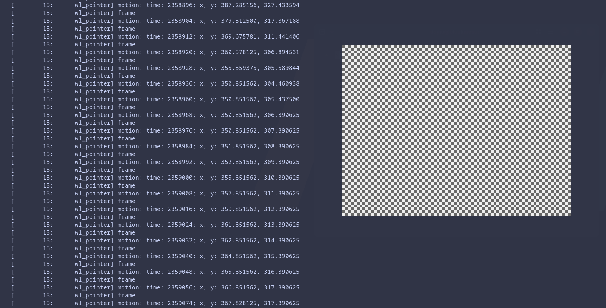

+++
date = '2026-04-07T15:10:00+02:00'
draft = false
tags = ['linux', 'hardware']
title = 'Fixing Logitech M575 Glitch'
+++

I use a Logitech M575 as my main cursor device because a trackball is far more comfortable to use and does not hurt the carpal tunnel at all, switching from a mouse to a trackball completely stopped the pain. It takes around one or two days to adapt. However, after its only benefits, you can use your "mouse" on any surface (plane, bed, ...), don't need a lot of space, it's close to the keyboard and does not move so no useless movements, etc...

Now I have an issue with it, it's maybe a defective unit, I don't know but sometimes, when I move the ball, the mouse triggers a "return" like if I am on a web browser and navigate, as soon as I move the ball, I'm teleported to the previous page, and it does not stop until I'm on the browser home page.

I've tried to switch OS, but it's the same, so it's not a software issue. Then changed the battery, and it worked for a bit (1 or 2 weeks), and today I had the same issue. So it's a hardware issue.
It proceeded to shake the mouse without the ball to see if there is a shortcut somewhere and no.
So in my opinion, it's a firmware issue, and for now I don't want to dig deeper, but I will try to dump it in the future to see what's going on!

Now as we can see with the commande `wev` (on Wayland and `xev` on X11) all the events triggered by the mouse



And at one point there is this log

```shell
...
[ 15: wl_pointer] frame
[ 15: wl_pointer] motion: time: 502281; x, y: 145.367188, 202.351562
[ 15: wl_pointer] frame
[ 15: wl_pointer] motion: time: 502289; x, y: 145.367188, 203.351562
[ 15: wl_pointer] frame

[ 15: wl_pointer] button: serial: 1498; time: 502297; button: 275 (side), state: 1 (pressed)

[ 15: wl_pointer] frame
[ 15: wl_pointer] motion: time: 502305; x, y: 145.367188, 205.351562
[ 15: wl_pointer] frame
[ 15: wl_pointer] motion: time: 502313; x, y: 146.367188, 207.351562
[ 15: wl_pointer] frame
...
```

`button: serial: 1498; time: 502297; button: 275 (side), state: 1 (pressed)` and I didn't press anything and the `button: 275` is the "back" button...

I had never used the "back" or "forward" button, so it's not a problem for me to disable them.

Using `evtest` we can extract the hardware event code used by the operating system, Fedora for me, and those are different from the universal codes like `275`.

```shell
➜  ~ sudo evtest
No device specified, trying to scan all of /dev/input/event*
Available devices:
/dev/input/event0:      Power Button
/dev/input/event1:      Lid Switch
/dev/input/event15:     PC Speaker
/dev/input/event2:      Sleep Button
/dev/input/event3:      Power Button
/dev/input/event7:      Logitech ERGO M575
....
Select the device event number [0-22]:
```

Here I type `7` as it's the device I need to inspect

```shell
Select the device event number [0-22]: 7
Input driver version is 1.0.1
Input device ID: bus 0x3 vendor 0x46d product 0x4096 version 0x111
Input device name: "Logitech ERGO M575"

Supported events:
Event type 0 (EV_SYN)
Event type 1 (EV_KEY)
Event code 272 (BTN_LEFT)
Event code 273 (BTN_RIGHT)
Event code 274 (BTN_MIDDLE)
Event code 275 (BTN_SIDE)
Event code 276 (BTN_EXTRA)
Event code 277 (BTN_FORWARD)
Event code 278 (BTN_BACK)
Event code 279 (BTN_TASK)
Event code 280 (?)
Event code 281 (?)
Event code 282 (?)
Event code 283 (?)
Event code 284 (?)
Event code 285 (?)
Event code 286 (?)
Event code 287 (?)
Event type 2 (EV_REL)
Event code 0 (REL_X)
Event code 1 (REL_Y)
Event code 6 (REL_HWHEEL)
Event code 8 (REL_WHEEL)
Event code 11 (REL_WHEEL_HI_RES)
Event code 12 (REL_HWHEEL_HI_RES)
Event type 4 (EV_MSC)
Event code 4 (MSC_SCAN)

Properties:

Testing ... (interrupt to exit)

Event: time 1775547191.433856, -------------- SYN_REPORT ------------
Event: time 1775547191.451596, type 2 (EV_REL), code 1 (REL_Y), value 1

...

Event: time 1775547191.763597, -------------- SYN_REPORT ------------
Event: time 1775547191.771590, type 2 (EV_REL), code 0 (REL_X), value 2
Event: time 1775547191.771590, type 2 (EV_REL), code 1 (REL_Y), value -2

Event: time 1775547191.771590, -------------- SYN_REPORT ------------
Event: time 1775547191.779589, type 4 (EV_MSC), code 4 (MSC_SCAN), value 90004
Event: time 1775547191.779589, type 1 (EV_KEY), code 275 (BTN_SIDE), value 1
Event: time 1775547191.779589, type 2 (EV_REL), code 0 (REL_X), value 1
Event: time 1775547191.779589, type 2 (EV_REL), code 1 (REL_Y), value -2

Event: time 1775547191.779589, -------------- SYN_REPORT ------------
Event: time 1775547191.787928, type 2 (EV_REL), code 0 (REL_X), value 2
Event: time 1775547191.787928, type 2 (EV_REL), code 1 (REL_Y), value -2

...
```

Here we can see that the value `90004` is the equivalent of the code `275` so we can now use this code to create a `hwdb` rule.

First with create a file

```shell
sudo nano /etc/udev/hwdb.d/90-m575-block.hwdb
```

With this content and pay attention to the space before `KEYBOARD_KEY_90004` it is mandatory.

```shell
evdev:name:*M575*
 KEYBOARD_KEY_90004=reserved
```

Then we save the file and update the `hwdb` and propagate the changes

```shell
sudo systemd-hwdb update
sudo udevadm trigger
```

And voilà. I don't have any issue with the back button. It's a temporary fix as if I move on Windows or MacOS, I'll have the same issue.
